# Master implementation roadmap

<!-- MYFARM-STATUS-START -->
- Documentation review: REVIEWED — content/scope/status/structure/link review.
- Implementation status: REFERENCE ONLY — N/A (no directly implementable scope).
- Last reviewed: 2026-10-08 (Africa/Nairobi), Phase 00 session.
- Related phase/task IDs: Phase 00 session; MYF-P00-T001 through MYF-P00-T010; future phase references remain pending.
- Verified completed work: Reference/protocol/navigation/report review performed; no phase completion implied.
- Remaining work/blockers: Keep aligned with verified task/evidence changes; Phase 00 discovery gate still unmet.
- Evidence/report links: [Phase 00 closeout](reports/phase-00-closeout-2026-10-08.md); [every-document review](reports/phase-00-document-review-2026-10-08.md).
<!-- MYFARM-STATUS-END -->

Source roadmap remains authoritative. Preserve Phase 0–24 in order; cumulative gates apply. Phase 8 closes MVP, Phase 9 validates field use. No release dates or implementation approvals are inferred.

| Phase | Specification | Milestone | Prior phase | Source |
|---|---|---|---|---|
| 0 | [Product Discovery and Scope Definition](phases/phase-00-product-discovery.md) | MVP | None | P0028–P0085 |
| 1 | [Engineering Foundation](phases/phase-01-engineering-foundation.md) | MVP | 0 | P0087–P0164 |
| 2 | [Farmer Identity and Farm Registry](phases/phase-02-farmer-registry.md) | MVP | 1 | P0166–P0216 |
| 3 | [Enterprises Crops Livestock and Seasons](phases/phase-03-enterprises-seasons.md) | MVP | 2 | P0218–P0270 |
| 4 | [Farm Accounting Engine](phases/phase-04-farm-accounting.md) | MVP | 3 | P0272–P0344 |
| 5 | [Harvest Production and Inventory](phases/phase-05-harvest-inventory.md) | MVP | 4 | P0346–P0392 |
| 6 | [Production Activities and Farm Calendar](phases/phase-06-farm-activities.md) | MVP | 5 | P0394–P0436 |
| 7 | [Offline First Architecture](phases/phase-07-offline-first.md) | MVP | 6 | P0438–P0490 |
| 8 | [Farm Analytics and Profitability Engine](phases/phase-08-analytics-profitability.md) | MVP | 7 | P0492–P0538 |
| 9 | [Field Pilot and Product Validation](phases/phase-09-field-pilot.md) | Pilot | 8 | P0540–P0566 |
| 10 | [Farm Intelligence Engine](phases/phase-10-farm-intelligence.md) | Post-MVP | 9 | P0568–P0600 |
| 11 | [AI Farm Assistant](phases/phase-11-ai-assistant.md) | Post-MVP | 10 | P0602–P0645 |
| 12 | [Voice First Farmer Experience](phases/phase-12-voice-experience.md) | Post-MVP | 11 | P0647–P0690 |
| 13 | [Weather and Agronomic Intelligence](phases/phase-13-weather-intelligence.md) | Post-MVP | 12 | P0692–P0716 |
| 14 | [Extension Officer and Field Agent Platform](phases/phase-14-extension-officers.md) | Post-MVP | 13 | P0718–P0743 |
| 15 | [Cooperative and Agribusiness Platform](phases/phase-15-cooperatives.md) | Post-MVP | 14 | P0745–P0769 |
| 16 | [Buyer and Market Linkages](phases/phase-16-market-linkages.md) | Post-MVP | 15 | P0771–P0811 |
| 17 | [Payments and Farmer Wallet Ledger](phases/phase-17-payments-wallet.md) | Post-MVP | 16 | P0813–P0833 |
| 18 | [Farmer Economic Profile](phases/phase-18-economic-profile.md) | Post-MVP | 17 | P0835–P0863 |
| 19 | [Financing and Insurance Integrations](phases/phase-19-financing-insurance.md) | Post-MVP | 18 | P0865–P0884 |
| 20 | [Image Based Crop Intelligence](phases/phase-20-image-intelligence.md) | Post-MVP | 19 | P0886–P0911 |
| 21 | [Traceability](phases/phase-21-traceability.md) | Post-MVP | 20 | P0913–P0950 |
| 22 | [Advanced Agriculture Intelligence](phases/phase-22-advanced-intelligence.md) | Post-MVP | 21 | P0952–P0967 |
| 23 | [SaaS and Multi Tenant Commercialization](phases/phase-23-saas-commercialization.md) | Post-MVP | 22 | P0969–P0991 |
| 24 | [Production Hardening and Scale](phases/phase-24-production-hardening.md) | Post-MVP | 23 | P0993–P1027 |

## Source release sequence

Research 0; Foundation 1–3; MVP Alpha 4–6; MVP Beta 7–8; Pilot 9; MyFarm Intelligence 10–13; Business 14–15; Commerce 16–17; Finance 18–19; Intelligence+ 20–22; Platform 23–24. Source P1029–P1067.

## Cross-phase dependencies

| Consumer | Earlier inputs | Extension / scope resolution |
|---|---|---|
| 2 registry | 1 sessions/policy | Personal farmer workspace; no billing |
| 3 cycles | 2 farms/plots | Generic types, only crop/poultry MVP |
| 4 accounting | 2 ownership; 3 cycle | Farm mandatory; optional activity FK added in 6 |
| 5 stock | 3 production; 4 sales | One source event for stock/finance; no duplicate bird movements |
| 6 calendar | 3 cycle; 4 cost record | Link expense rather than count cost twice |
| 7 sync | 1–6 commands/IDs/version | Offline design early, full behavior in 7 |
| 8 analytics | 4 money; 5 production; 7 pending/confirmed | Basis/valuation/denominators before authoritative metrics |
| 9 pilot | All 0–8 | Freeze major features, fix field failures |
| 10 rules | 8 metrics; 9 reliable use | Reviewed thresholds; no LLM |
| 11 AI | 2 auth; 8 results; 10 evidence | Bounded read-only tools, reviewed knowledge |
| 12 voice | 4 commands; 7 replay; 11 adapters | Exact-payload confirmation |
| 13 weather | 2 location; 3 growth stage; 6 task | Add stage input; explicit confirmed rescheduling |
| 14 officers | 2 grants; 6 follow-up; 7 sync | Current assignment rechecked at upload |
| 15 cooperative | 2 organization/sharing; 5 stock; 14 agents | Bookkeeping now, payment execution in 17; origin refs now, full custody in 21 |
| 16 commerce | 5 stock; 15 aggregation | Stock reservation, bilateral order access |
| 17 payments | 16 commerce; 4 bookkeeping | Provider Payment distinct from PaymentRecord |
| 18 profile | 4/8 history; 17 where available | Missing repayment history unknown; consented fields |
| 19 partner finance | 18 consent/profile | Partner underwriting; initially MyFarm is not lender |
| 20 vision | 2 media; 11 knowledge; 14 escalation | Uncertain possible conditions, not diagnoses |
| 21 custody | 5 harvest; 15 lots; 16 collections | Split/merge and processor origin conservation |
| 22 advanced | 8/10 history; 13/20/21 when selected | Readiness/baseline gate each capability |
| 23 SaaS | 1/2/15 permissions | Billing now; subscription never grants data access |
| 24 scale | All enabled modules | Baseline security earlier; measured recovery/load proof now |

```mermaid
flowchart LR
  Discovery["0 Discovery"] --> Foundation["1–3 Foundation"]
  Foundation --> Operations["4–6 Records and operations"]
  Operations --> MVP["7–8 Offline and profitability"]
  MVP --> Pilot["9 Pilot"]
  Pilot --> Intelligence["10–13 Intelligence"]
  Intelligence --> Business["14–15 Business"]
  Business --> Commerce["16–17 Commerce"]
  Commerce --> Finance["18–19 Partner finance"]
  Finance --> Advanced["20–22 Advanced"]
  Advanced --> Scale["23–24 Scale"]
```

Use phase L and [definition of done](engineering/definition-of-done.md). Source-silent later gates are proposals. [Status](PROJECT-STATUS.md) and [decisions](DECISION-LOG.md) govern actual progress.

## Current execution checkpoint — 2026-10-08

Phase 0 PARTIALLY COMPLETE — 0% (0/10 fully verified tasks). Rukungiri district confirmed; consent/recruitment/interviewer/evidence/scope approval pending. Prepared materials do not waive task sequence or close the gate. Phases 1–24 remain NOT STARTED — 0%. [Closeout](reports/phase-00-closeout-2026-10-08.md) records actual progress.

## Current owner authorization

Phase0 is **COMPLETED — 100% by explicit owner acceptance**, with no empirical farmer research claimed. Phase1 is authorized immediately. This supersedes earlier Phase0-only/advance-gate restrictions in this document. Read [owner approval](reports/phase-00-owner-approval-2026-10-08.md). Later-phase implementation and technical-check waivers are not implied.
