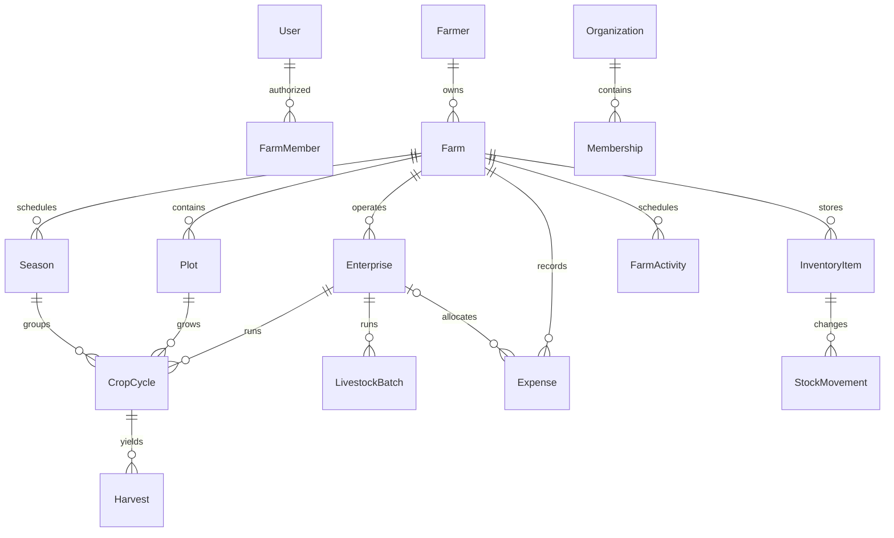

# Domain model

<!-- MYFARM-STATUS-START -->
- Documentation review: REVIEWED — status/applicability/structure/link review; no runtime or independent product validation.
- Implementation status: NOT STARTED — 0% (runtime implementation not verified).
- Last reviewed: 2026-10-08 (Africa/Nairobi), Phase 00 session.
- Related phase/task IDs: Future Phases 01–24 as referenced; session review Phase 00; MYF-P01-T001 through MYF-P01-T013.
- Verified completed work: Architecture reference reviewed for current applicability; no runtime implementation completed.
- Remaining work/blockers: Affected future tasks/decisions and phase authorization; no database/app/deployment present.
- Evidence/report links: [Phase 00 closeout](../reports/phase-00-closeout-2026-10-08.md); [every-document review](../reports/phase-00-document-review-2026-10-08.md).
<!-- MYFARM-STATUS-END -->

**Proposed relationships and bounded domains.** Source entities/fields are preserved in the relevant phase F; support rows such as receipts, assignments and consent grants are recommendations.

User is authenticated principal; Farmer is agricultural identity/profile. Cardinality and agent-assisted onboarding remain Q05/Q23. FarmMember grants farm access; Organization Membership alone never grants private farmer history. Explicit sharing/assignment records control institutional use.

EnterpriseType is generic; a plot-linked CropCycle models seasonal/perennial crop choices after Q07. Poultry batch need not attach to a land plot. Current flock = opening + acquisitions − mortality − bird sales ± approved adjustments; eggs/feed tracked in separate units/events. Never decrement birds twice through production and inventory.

Accounting uses farm-required records with optional plot/enterprise/season/activity links. Sale revenue and PaymentRecord collections must not double-count. Receivable/Payable derives from obligation and allocations; future provider Payment is a different lifecycle. Stock source references link harvest/sales to one posting.

Later domains: organization procurement/order/reservation/collection; immutable wallet journal; consented economic snapshots/partner offers; private image assessment; lot lineage/custody; evaluated forecasts; entitlements. Add their tables in their phases, not because this diagram is written. [Phases](../MASTER-IMPLEMENTATION-ROADMAP.md), [multi-tenancy](multi-tenancy.md) and [financial rules](financial-integrity.md) govern ownership/integrity.
