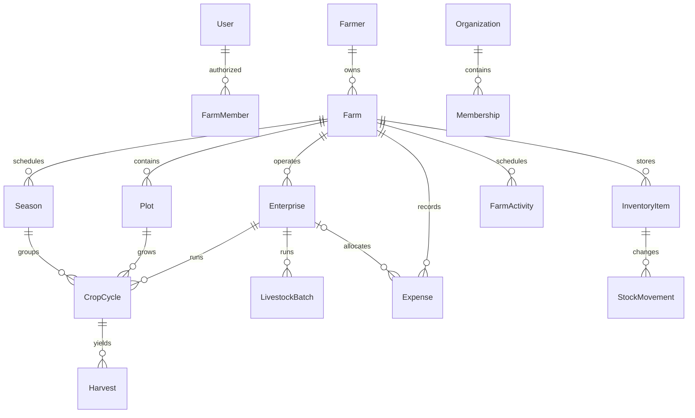

# Domain model

<!-- MYFARM-STATUS-START -->
- Documentation review: REVIEWED — Phase02 closeout; content and status updated from verified evidence; no completion inferred from review alone.
- Implementation status: PARTIALLY COMPLETE — Phase02 registry entity scope 100% verified (13/13 Phase02 tasks); later-phase entity scope 0%; no whole-document percentage claimed.
- Last reviewed: 2026-10-09 (Africa/Nairobi), Phase02 implementation and closeout session.
- Related phase/task IDs: Phase02 MYF-P02-T001–T013; later phases per roadmap.
- Verified completed work: Farmer, FarmerProfile, Farm, Plot, FarmMember implemented; User/Organization reused; Address/Contact as columns; Document deferred (D-P02-003).
- Remaining work/blockers: Enterprises/seasons (Phase3) onward NOT STARTED; Document entity awaits retention policy (P2-C5).
- Evidence/report links: [Phase02 closeout](../reports/phase-02-closeout-2026-10-09.md); [Phase02 every-document review](../reports/phase-02-document-review-2026-10-09.md)
<!-- MYFARM-STATUS-END -->

**Proposed relationships and bounded domains.** Source entities/fields are preserved in the relevant phase F; support rows such as receipts, assignments and consent grants are recommendations.

User is authenticated principal; Farmer is agricultural identity/profile. Cardinality and agent-assisted onboarding remain Q05/Q23. FarmMember grants farm access; Organization Membership alone never grants private farmer history. Explicit sharing/assignment records control institutional use.

EnterpriseType is generic; a plot-linked CropCycle models seasonal/perennial crop choices after Q07. Poultry batch need not attach to a land plot. Current flock = opening + acquisitions − mortality − bird sales ± approved adjustments; eggs/feed tracked in separate units/events. Never decrement birds twice through production and inventory.

Accounting uses farm-required records with optional plot/enterprise/season/activity links. Sale revenue and PaymentRecord collections must not double-count. Receivable/Payable derives from obligation and allocations; future provider Payment is a different lifecycle. Stock source references link harvest/sales to one posting.

Later domains: organization procurement/order/reservation/collection; immutable wallet journal; consented economic snapshots/partner offers; private image assessment; lot lineage/custody; evaluated forecasts; entitlements. Add their tables in their phases, not because this diagram is written. [Phases](../MASTER-IMPLEMENTATION-ROADMAP.md), [multi-tenancy](multi-tenancy.md) and [financial rules](financial-integrity.md) govern ownership/integrity.

## Phase 2 implementation (2026-10-09)

Implemented Phase 2 subset ([closeout](../reports/phase-02-closeout-2026-10-09.md)):

- **Identity (Q05):** one Farmer per User, owned by a PERSONAL Organization ([D-P02-002](../DECISION-LOG.md#d-p02-002--q05-identity-model)). FarmerProfile holds the minimal contact/location fields ([D-P02-003](../DECISION-LOG.md#d-p02-003--q06-data-minimization)) with an optimistic `version`.
- **Farms:** Farm (owner farmer, optional acreage and GPS pair); Plot (unique name per farm, optional area with unit); FarmMember (OWNER).
- **Deferred:** Address and Contact are columns rather than tables; Document is deferred until a retention policy exists. Later-phase entities remain NOT STARTED.
