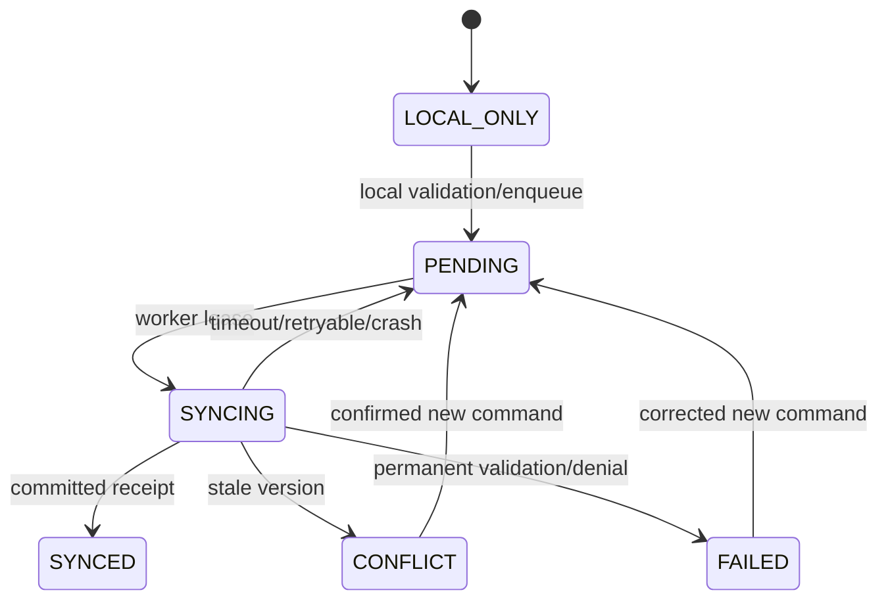

# Offline synchronization architecture

<!-- MYFARM-STATUS-START -->
- Documentation review: REVIEWED — Phase02 closeout status/link review; content unchanged; no completion inferred from review.
- Implementation status: NOT STARTED — 0% (direct feature scope unimplemented).
- Last reviewed: 2026-10-09 (Africa/Nairobi), Phase02 implementation and closeout session.
- Related phase/task IDs: Future phase architecture as referenced; Phase01 review session T001–T013; Phase02 review session (MYF-P02-T001–T013).
- Verified completed work: Scope/status/provider applicability reviewed; no financial/offline/farm-domain runtime implementation verified.
- Remaining work/blockers: Associated future tasks, business decisions and exit gates pending; no phase advancement.
- Evidence/report links: [Phase02 closeout](../reports/phase-02-closeout-2026-10-09.md); [Phase02 every-document review](../reports/phase-02-document-review-2026-10-09.md); [Phase01 closeout](../reports/phase-01-closeout-2026-10-08.md); [every-document review](../reports/phase-01-document-review-2026-10-08.md); [latest provider/security report](../reports/phase-01-provider-verification-2026-10-08.md).
<!-- MYFARM-STATUS-END -->

Offline farmer experience is mandatory by MVP Phase 8. Source P0456–P0479 requires expense/income/harvest/activity/task/photo recording and cached farm/record viewing; clientMutationId, deviceId, createdAt, updatedAt, syncStatus, version; six source states. Foundation prepares command boundaries, but complete sync is Phase 7.

## Proposed client/server contract

Local IndexedDB transaction persists draft/domain view and outbox together. Each intent gets stable clientMutationId, deviceId, local timestamps, actor/tenant partition, operation, entityId, schemaVersion, payload and baseVersion. Client identity fields are routing hints, never server authority. Reuse ID only for identical intent. Edit a rejected command by making a new ID referencing the prior one.

POST /api/v1/sync/push accepts a bounded batch. Server re-authenticates each command, validates related scope, locks/checks versions and atomically writes domain effects, scoped MutationReceipt with requestHash/result, audit and change-log. Unique (tenantId,actorId,clientMutationId) arbiters concurrent retries; compare payload hash before returning stored result. Duplicate HTTP calls are expected; exactly one domain effect is required.

Response per command: committed/replayed receipt, conflict with current authorized version, retryable failure, or permanent failure/denied. A lost response leaves queue pending; replay reads stored receipt, not a second transaction. Receipt retention must cover supported retry/offline window, or provide safe dedupe recovery before pruning (Q16).

GET /api/v1/sync/pull uses opaque authorized cursor with a transaction-consistent monotonic server change sequence. Return bounded pages and deletion tombstones. Record cache update plus cursor atomically. Client clocks never order changes. Expired cursor requires scoped full snapshot reconciliation that preserves pending commands and does not resurrect deletions. Pull sequence allocation/order must avoid skipped late commits (implementation proof required).

## State machine

Retry with bounded exponential backoff/jitter; honor server retry-after. Network flaps do not spawn duplicate workers. Multi-tab queue leases expire/recover; server receipt still provides ultimate dedupe. Foreground launch/online event/manual retry are required; background sync is optional browser enhancement, not guaranteed delivery.

Commands depending on locally-created parents order topologically or wait for receipt. Financial/stock entries append, never last-writer-wins. Editable notes/tasks use base-version conflict and explicit user reconciliation; no blind overwrite of money/stock. Insufficient authoritative stock after offline sale rejects visibly; local preview is provisional.

Photos persist BlobQueue metadata/blob then upload with stable ID/checksum after connectivity. Validate size/type/scope, obtain private upload grant, and finalize domain attachment only after verified object existence. Partial upload retries; orphan cleanup never deletes referenced files.

## Storage, privacy and recovery

Ask supported browser for persistence; denied permission is not a failure of all use, but durability is limited. Estimate quota and warn before writes. On QuotaExceededError rollback local save and show retry/export/sync guidance. Browser clearing/eviction/device loss can destroy never-synced records; **do not claim guaranteed recovery**. Distinguish last server sync and pending count. Approved encrypted/export recovery procedure is Q16, not implemented by documentation.

Local tenant/user partition and lock policy address shared phones. Logout protects cached access while preserving pending edits through explicit approved recovery; no accidental purge. Server rejects revoked scope on reconnect. SW updates/Dexie migrations must preserve pending outbox and support version skew.

Test eight actions offline/reload, quota denial, crash during write/sync, duplicate/concurrent/lost-ack replay, two-device edits, clock skew, parent dependency, tombstones/expired cursors, revoked memberships and photo partial failures. Meaningful offline duration/row/media limits must be measured on approved devices. [API](api-design-standards.md), [financial integrity](financial-integrity.md) and [testing](testing-strategy.md) define authoritative boundaries. Browser limitations follow [MDN storage](https://developer.mozilla.org/en-US/docs/Web/API/Storage_API/Storage_quotas_and_eviction_criteria), checked 2026-10-08.
