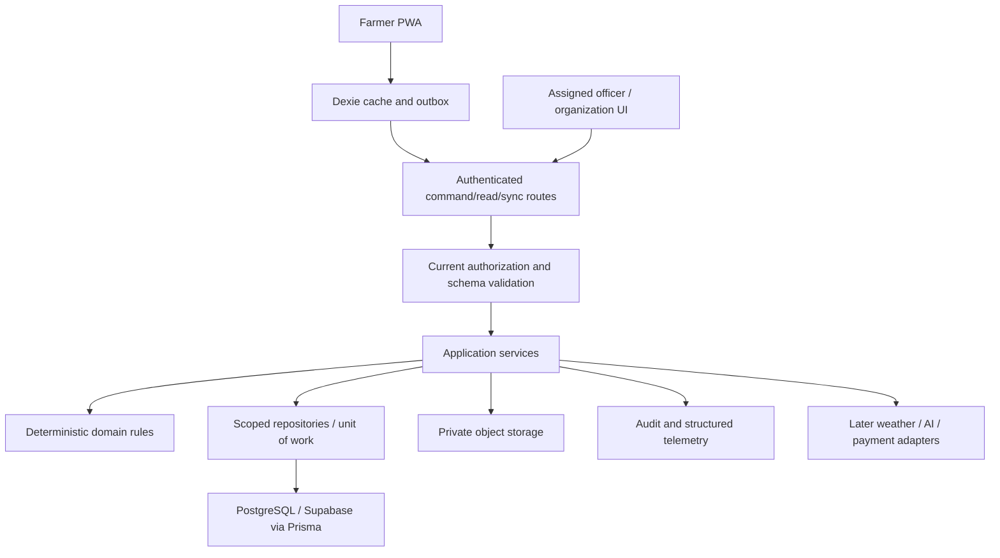

# System architecture

<!-- MYFARM-STATUS-START -->
- Documentation review: REVIEWED — Phase02 closeout; content and status updated from verified evidence; no completion inferred from review alone.
- Implementation status: Phase01 scope COMPLETED — 100% (13/13 verified Phase01 tasks; PASS WITH CONDITIONS — LOCAL VERIFICATION); Phase02 scope COMPLETED — 100% (13/13 verified Phase02 tasks; PASS WITH CONDITIONS — LOCAL VERIFICATION); later-phase scope not counted.
- Last reviewed: 2026-10-09 (Africa/Nairobi), Phase02 implementation and closeout session.
- Related phase/task IDs: Phase01 MYF-P01-T001–T013; Phase02 MYF-P02-T001–T013.
- Verified completed work: Phase01 scope as previously verified; Phase02: farmer registry contracts/policies/migration/API/tests in this document's area verified (see the Phase 2 implementation section).
- Remaining work/blockers: Phase02 conditions P2-C1–P2-C8 where applicable; later-phase scope pending authorization.
- Evidence/report links: [Phase02 closeout](../reports/phase-02-closeout-2026-10-09.md); [Phase02 every-document review](../reports/phase-02-document-review-2026-10-09.md); [Phase01 closeout](../reports/phase-01-closeout-2026-10-08.md); [every-document review](../reports/phase-01-document-review-2026-10-08.md); [latest provider/security report](../reports/phase-01-provider-verification-2026-10-08.md).
<!-- MYFARM-STATUS-END -->

Baseline required by source/request: Next.js App Router/React/TypeScript PWA, server application services/domain/repositories, Prisma and PostgreSQL/Supabase, Vercel, private object storage, Dexie/IndexedDB and custom sync. Proposed deployment is one modular application, not microservices.

Client owns entry, offline drafts, status and display. Server owns authority, tenant scope, calculations, version checks, atomic domain effects, receipt/audit/change-log. Database is authoritative; local data is cached or unacknowledged. Service worker caches the public app shell, not indiscriminate personalized server responses.

Proposed modules: identity/policy, registry, production, accounting, inventory, activities, sync, analytics, then later intelligence/assistant/voice/weather, officers/organizations/commerce/payments/profile/partners/vision/trace/forecasts/subscriptions/operations. Phase-specific slug directories are proposals; module ownership must be agreed before code. Modules expose application interfaces, not cross-module table access from UI.

Example expense flow: form schema → command with stable mutation ID → server auth/current FarmMember → validate enterprise/season scope → exact decimal rules → atomically expense + receipt + audit + change log → scoped result. Online and offline replay use the same command service.

Long external calls use durable intent/outbox plus reconciliation; no promise of in-memory background work completing after a serverless request. Add a durable worker/queue only where enabled provider workload needs one. [Stack](technology-stack.md), [database](database-architecture.md), [sync](offline-sync-architecture.md) and [ADRs](architecture-decisions.md) provide contracts.

## Phase1 implemented evidence and limits

Phase1 source implements UI → application → domain/contracts → scoped Prisma repository. Independent domain/provider boundary tests pass. Supabase auth/PG selected. Future accounting/stock functions are type-only interfaces; Dexie/service-worker/custom sync is not implemented.

[Closeout](../reports/phase-01-closeout-2026-10-08.md); [setup](../engineering/foundation-local-setup.md).

## Phase 2 implementation (2026-10-09)

Added module `src/modules/farmer-registry/` (domain rules → contracts/ports → `FarmerRegistryService` → Prisma repository), API routes under `src/app/api/v1/`, and pages `/farmer`, `/farms` with a signed-in registry navigation. It follows the Phase 1 layering and boundary check; no new dependency ([closeout](../reports/phase-02-closeout-2026-10-09.md)).
